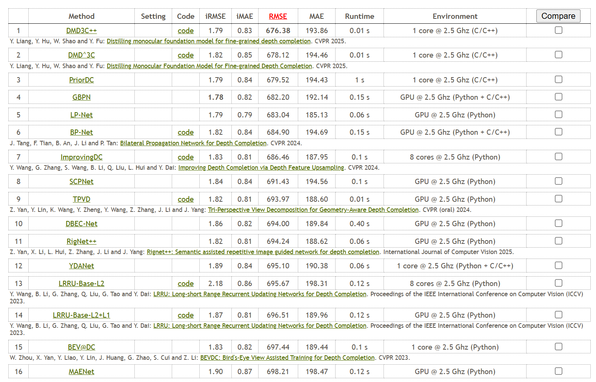
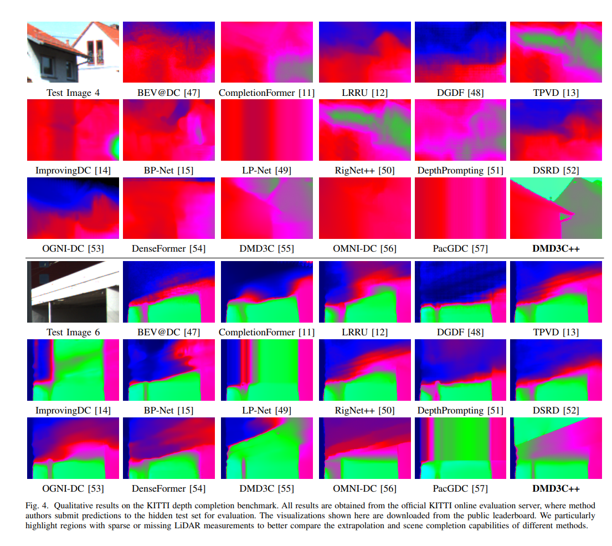

# DMD³C: Distilling Monocular Foundation Models for Fine-grained Depth Completion

<p align="center">
Official implementation of the CVPR 2025 paper  
<b>"Distilling Monocular Foundation Models for Fine-grained Depth Completion"</b>
</p>

<p align="center">
  <a href="https://arxiv.org/abs/2503.16970">
    
  </a>
  <a href="https://huggingface.co/datasets/Liangyingping/DMD3Cpp-checkpoints">
    
  </a>
  <a href="https://huggingface.co/datasets/Liangyingping/DCVerse">
    
  </a>
</p>

---

<div align="center">
  
</div>

---

## 🔍 Overview

Depth completion methods often suffer in regions with sparse or missing supervision, leading to inaccurate fine-grained structures and degraded depth quality.

**DMD³C** introduces a novel framework that distills rich geometric priors from **monocular foundation models** into the depth completion pipeline. By leveraging dense knowledge from foundation models, DMD³C significantly improves depth estimation quality, particularly in regions lacking ground-truth supervision.

### Key Features

- Distills geometric knowledge from monocular foundation models
- Enhances fine-grained structure recovery
- Improves depth estimation in sparse and unsupervised regions
- Achieves strong performance on benchmark datasets

---

<div align="center">
  
</div>

---

## 🚀 Getting Started

### 0. Conda Environment

You can directly build the environment by running the following command if you use conda as the environment management tool.

```bash
conda env create -f environment.yml
```

Compile the C++ and CUDA code:

```
cd exts
python setup.py install
```

### 1. Dataset Preparation

Please follow the dataset preparation instructions from:

👉 [BP-Net](https://github.com/kakaxi314/BP-Net)

The structure of data directory should be:

```
└── datas
    └── kitti
        ├── data_depth_annotated
        │   ├── train
        │   └── val
        ├── data_depth_velodyne
        │   ├── train
        │   └── val
        ├── raw
        │   ├── 2011_09_26
        │   ├── 2011_09_28
        │   ├── 2011_09_29
        │   ├── 2011_09_30
        │   └── 2011_10_03
        ├── test_depth_completion_anonymous
        │   ├── image
        │   ├── intrinsics
        │   └── velodyne_raw
        └── val_selection_cropped
            ├── groundtruth_depth
            ├── image
            ├── intrinsics
            └── velodyne_raw
```

### 2. Training

Run the training script:

```bash
bash train.sh
```

Our models are trained on 8 GPU workstation with Nvidia GTX 4090 (48G).

### 3. Pretrained Models

Download pretrained checkpoints from:

👉 [Hugging Face](https://huggingface.co/datasets/Liangyingping/DMD3Cpp-checkpoints)

Place the .pth file into "./checkpoints/PMP_Residual_Norm_ssil_KITTI/"

### 4. Submission

Generate predictions and submit results to the KITTI online benchmark:

```bash
bash submission.sh
```

The results will be save into "./results" folder.

---

<div align="center">
  
</div>

---

## 🌍 DCVerse Benchmark

### Download

To facilitate fair and reproducible evaluation of depth completion methods, we build **DCVerse**, a unified depth completion benchmark that standardizes the experimental settings across different methods and datasets.

DCVerse addresses inconsistencies commonly found in previous evaluations, including:

- Unified input image resolution
- Consistent sparse point sampling density
- Standardized sparse sampling strategies
- Unified evaluation metrics
- Cross-dataset evaluation protocol

The benchmark enables more reliable and direct comparisons between different depth completion methods.

The benchmark and processed data can be found at:

👉 [DCVerse on Hugging Face](https://huggingface.co/datasets/Liangyingping/DCVerse)

---

### Usage

```bash
#!/bin/bash

datasets=(
    ETH3D_SfM_Indoor_test
    ETH3D_SfM_Outdoor_test
    KITTIDC_test_LiDAR_64
    KITTIDC_test_LiDAR_32
    KITTIDC_test_LiDAR_16
    KITTIDC_test_LiDAR_8
    VOID_sample1500
    VOID_sample500
    VOID_sample150
    NYU_test_500
    NYU_test_200
    NYU_test_100
    NYU_test_50
    DDAD_val
)

mkdir -p results

for dataset in "${datasets[@]}"
do
    echo "======================================"
    echo "Running dataset: ${dataset}"
    echo "======================================"

    python test.py \
        gpus=[0] \
        name=PMP_Residual_Norm_ssil_KITTI_${dataset} \
        ++chpt=PMP_Residual_Norm_ssil_KITTI \
        net=PMP_Residual_Norm_fast \
        num_workers=4 \
        data=UNI \
        data.testset.mode=test \
        data.path=/PATH-TO-DATA/${dataset} \
        test_batch_size=1 \
        metric=MetricALL \
        ++save=true \
        2>&1 | tee "results/${dataset}.log"

done

echo "All tests finished."
```

The adapted implementations are available in the `benchmarks/` directory.

### Supported Methods

The current benchmark includes implementations of the following representative depth completion methods:

| Category | Methods |
|-----------|-----------|
| Classical Depth Completion | [LRRU](https://github.com/Sharpiless/DMD3Cpp/tree/main/benchmarks/LRRU), [VPP4DC](https://github.com/Sharpiless/DMD3Cpp/tree/main/benchmarks/VPP4DC), [CompletionFormer](https://github.com/Sharpiless/DMD3Cpp/tree/main/benchmarks/CompletionFormer), [ImprovingDC](https://github.com/Sharpiless/DMD3Cpp/tree/main/benchmarks/ImprovingDC), [BP-Net](https://github.com/Sharpiless/DMD3Cpp/tree/main/benchmarks/BP-Net), DepthPrompting, [OGNI-DC](https://github.com/Sharpiless/DMD3Cpp/tree/main/benchmarks/OGNI-DC), [DMD3C](https://github.com/Sharpiless/DMD3Cpp/tree/main/benchmarks/BP-Net) |
| Zero-shot Models | [G2-MD](https://github.com/Sharpiless/DMD3Cpp/tree/main/benchmarks/G2-MD), [Marigold-DC](https://github.com/Sharpiless/DMD3Cpp/tree/main/benchmarks/Marigold-DC), [SPNet](https://github.com/Sharpiless/DMD3Cpp/tree/main/benchmarks/SPNet), OMNI-DC, [PacGDC](https://github.com/Sharpiless/DMD3Cpp/tree/main/benchmarks/PacGDC) |
| Ours | Coming Soon |

We continuously maintain and extend the benchmark to include newly proposed methods and stronger baselines, providing a unified platform for fair and reproducible depth completion evaluation.


## 📝 Citation

If you find our work useful for your research, please consider citing:

```bibtex
@inproceedings{liang2025distilling,
  title={Distilling Monocular Foundation Models for Fine-grained Depth Completion},
  author={Liang, Yingping and Hu, Yutao and Shao, Wenqi and Fu, Ying},
  booktitle={Proceedings of the IEEE/CVF Conference on Computer Vision and Pattern Recognition (CVPR)},
  pages={22254--22265},
  year={2025}
}
```

---

## 🙏 Acknowledgement

This project is built upon and inspired by:

- [BP-Net](https://github.com/kakaxi314/BP-Net)

- [OMNI-DC](https://github.com/princeton-vl/OMNI-DC)

We sincerely thank the authors for making their code publicly available.